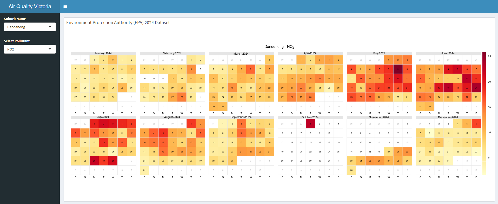

# 🌫️ Victoria Air Quality Dashboard (EPA 2024)

This interactive R Shiny application visualises EPA Victoria’s 2024 air quality data. It allows users to select a **suburb** and **pollutant** to explore daily pollutant levels throughout the year, presented in an intuitive calendar-style heatmap. The Data can be obtained from EPA's official [website](https://discover.data.vic.gov.au/dataset/epa-air-watch-all-sites-air-quality-hourly-averages-yearly).

🔗 [Live App](https://sulemanrasheed.shinyapps.io/Victoria_Air_Quality_EPA_2024_Data/)

---

## 📷 Dashboard Preview

---

## 🧭 Features

- Dynamic filters for suburb and pollutant selection
- Calendar heatmaps of daily pollutant levels across 2024
- Smooth and responsive R Shiny UI
- Visual cues for high pollution periods
- Designed for public accessibility, environmental monitoring, and policy insights

---

## 📁 Files in This Repo

| File | Description |
|------|-------------|
| `app.R` | Main Shiny application |
| `2024_All_sites_air_quality_hourly_avg.xlsx` | Cleaned EPA dataset (hourly → daily avg) |
| `Victoria_Air_Quality_Visualisation.Rproj` | RStudio project file |
| `images/dashboard.png` | Screenshot for GitHub preview |
| `README.md` | This documentation file |

---

## 🛠️ Tech Stack

- **Language**: R  
- **Libraries**: `shiny`, `ggplot2`, `lubridate`, `openair`, `shinydashboard`  
- **Visualization Type**: Time-series calendar heatmaps

---

## 🌏 Data Source

Data from the [EPA Victoria Open Data Portal](https://www.epa.vic.gov.au/for-community/environmental-information/air-quality)

---

## 🧑‍💻 Author

**Suleman Rasheed**  
PhD in Biomedical Engineering | Data Scientist  
📫 [SulemanRasheedEngr@gmail.com](mailto:SulemanRasheedEngr@gmail.com)  
🔗 [LinkedIn](https://www.linkedin.com/in/suleman-rasheed)

---

## 📄 License

This project is intended for educational and public outreach purposes. Please attribute if reusing.
